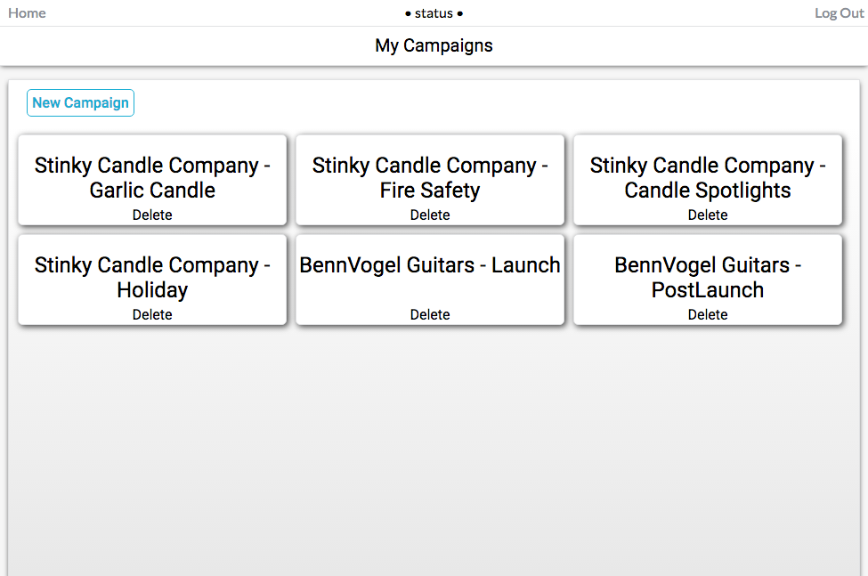
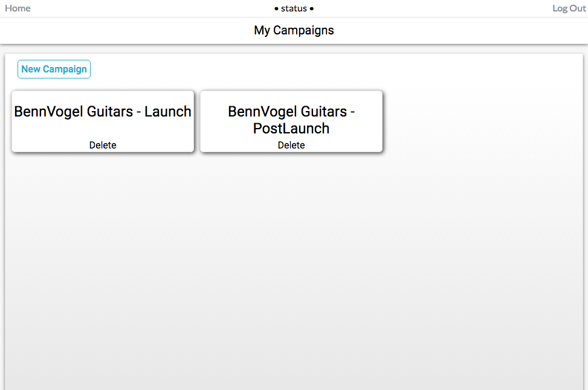
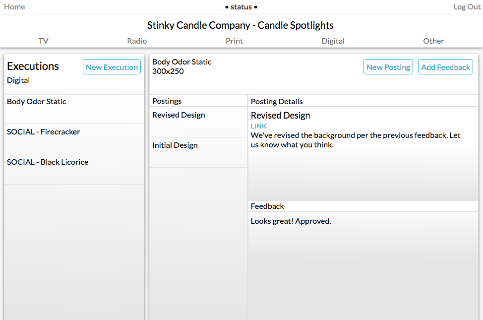

# Status

Status is an original application with design inspired by Asana.  It is powered by Ruby on Rails on the backend, fueled by a PostgreSQL database, and uses React.js on the frontend (with a Redux framework).

## Component Hierarchy:
- Campaigns
  - Executions
    - Postings
      - Feedback

Each component has a has_many relationship with its direct child.

## Features and Implementation

### Campaign Tracking & User Assignment

The database has separate tables for both campaigns and users.  A join table is also present (Memberships) that keeps track of which users have been assigned to work on which campaigns.  In addition, the creator (and therefore assigner) of each campaign is the only user with authorization to delete it, which is verified by a manager_id column in the campaigns table.  Upon login, and API call is fired off to the backend, which uses an association to determine which campaigns are visible to the current user, and then returns them along with the appropriate details.

While one user may be involved in many campaigns...

Others may only be responsible for a couple...

### Campaign Detail & Media Type

Upon selecting a campaign, the React Router renders the CampaignDetail component, which makes an API request to receive all relevant data from the database.  By making liberal use of the componentWillReceiveProps and componentDidMount lifecycle methods, the CampaignDetail component makes an initial API request upon mounting, which queries the database for all associated executions that have the media_type of "TV".  After those (if any) executions are loaded, additional request can be made for difference media types by clicking on them, which sets the state to reflect this selected media type, allowing for a request to be made for the appropriate set of executions for that campaign.

### Postings & Feedback

After ExecutionIndex has been rendered, the first posting (the backend returns the most recent list item first) is automatically selected to display its full details, and then fire off another API request to check if there is any feedback associated with it.  If feedback is found, it is rendered on the frontend.  After this initial load is complete, any specific posting can be selected, which will fire off a similar API request, but now for whichever posting list item the user has selected.  As shown in the component hierarchy above, all components hold a has_many association to their immediate child, which allows the selection of any component to render out the appropriate index list of their child component.

Status allows you to see every detail about any aspect of a campaign.

## The Future of Status

This project was conceived through frustrations I experienced in the field of advertising, as managing projects across multiple people and organizations became incredibly hard to keep track of through email alone.  I plan to continue adding features to Status and potentially sharing it with my friends still in the advertising industry for their input.  However, my immediate next steps for improvement are the following:

## User Invites

Currently, any user can instantly assign any other user to a created campaign.  I plan to refactor this into an invite system where users can send out invites to their created campaigns.

## Approvals

Currently, all members (that are not the campaign creator) have the same functionality.  I want to add the functionality for the creator of a campaign to assign certain members approval power, so that they can mark executions and campaigns as approved when necessary.
